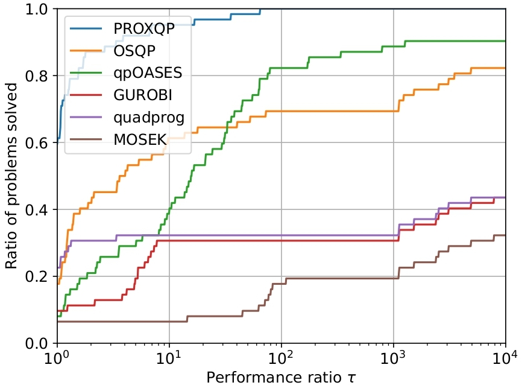

<p align="center">
  
</p>

<p align="center">
  <a href="https://opensource.org/licenses/BSD-2-Clause"></a>
<a href="https://github.com/jcarpent/proxqp-unofficial/actions/workflows/ci-linux-osx-with-conda.yml"></a>
</p>

**ProxSuite** is a collection of open-source, numerically robuste, precise and efficient numerical solvers (e.g., LPs, QPs, etc.) rooted on revisited primal-dual proximal algorithms.
While the first targeted application is Robotics, **ProxSuite** can be used in other contextes without any limits.
Through **ProxSuite**, we aim at offering to the community scalable optimizers which can deal with dense, sparse or matrix-free problems.

**ProxSuite** is actively developped and supported by the [Willow](https://www.di.ens.fr/willow/) and [Sierra](https://www.di.ens.fr/sierra/) research groups, joint research teams between [Inria](https://www.inria.fr/en), [École Normale Supérieure de Paris](https://www.ens.fr) and [Centre National de la Recherche Scientifique](https://www.cnrs.fr).

## **ProxQP**

The **ProxQP** solver is a numerical optimization package for solving problems of the form:

$$
\begin{align} 
\min_{x} &  ~\frac{1}{2}x^{T}Hx+g^{T}x \\
\text{s.t.} & ~A x = b \\
& ~l \leq C x \leq u
\end{align}
$$

where $x \in \mathbb{R}^n$ is the optimization variable. The objective function is defined by a positive semidefinite matrix $H \in \mathcal{S}^n_+$ and a vector $g \in \mathbb{R}^n$. The linear constraints are defined by the equality-contraint matrix $A \in \mathbb{R}^{n_\text{eq} \times n}$ and the inequality-constraint matrix $C \in \mathbb{R}^{n_\text{in} \times n}$ and the vectors $b \in \mathbb{R}^{n_\text{eq}}$, $l \in \mathbb{R}^{n_\text{in}}$ and $u \in \mathbb{R}^{n_\text{in}}$ so that $b_i \in \mathbb{R},~ \forall i = 1,...,n_\text{eq}$ and $l_i \in \mathbb{R} \cup \{ -\infty \}$ and $u_i \in \mathbb{R} \cup \{ +\infty \}, ~\forall i = 1,...,n_\text{in}$.

### Citing **ProxQP**

If you are using **ProxQP** for your work, we encourage you to [cite the related paper](https://hal.inria.fr/hal-03683733/file/Yet_another_QP_solver_for_robotics_and_beyond.pdf/).

### Numerical benchmarks

The numerical benchmarks of **ProxQP** against other commercial and open-source solvers are available [here](https://github.com/Bambade/qp_benchmark).

For dense Convex Quadratic Programs with inequality and equality constraints, when asking for a relatively high accuracy (e.g., 1.E-6), one obtains the following results.

<p align="center">
  
</p>

For hard problems from the [Maros Meszaros testset](http://www.cuter.rl.ac.uk/Problems/marmes.shtml), when asking for a high accuracy (e.g., 1.E-9), one obtains the results below.

<p align="center">
  
</p>

These results have been obtained with a 11th Gen Intel(R) Core(TM) i7-11850H @ 2.50GHz CPU.

## Installation

### Building from source

#### Required install dependencies

The following dependencies are required at compile time:

* CMake
* Eigen >= 3.0.5
* C++ >= 17

#### Installation instructions

1. Clone this repository with:

```bash
git clone https://github.com/Simple-Robotics/proxsuite.git --recursive
```

2. Create a build tree using CMake, build and install:

```bash
mkdir build && cd build
cmake .. -DCMAKE_BUILD_TYPE=Release -DBUILD_TESTING=OFF
make
make install
```

3. Build the Python interface

You just need to ensure that Python3 is indeed present on your system and activate the cmake option `BUILD_PYTHON_INTERFACE=ON` by replacing:

```bash
mkdir build && cd build
cmake .. -DCMAKE_BUILD_TYPE=Release -DBUILD_TESTING=OFF -DBUILD_PYTHON_INTERFACE=ON
make
make install
```

4. Generate the doc

To build the documentation, you need installing Doxygen. Once it is done, it then is as simple as:

```bash
make doc
open doc/doxygen_html/index.html
```

#### Disabling vectorization

We highly encourage you to enable the vectorization of the underlying linear algebra for the best performances.
They are active by default in **ProxSuite**.
Yet, some CPU architectures may not support such operations.
You just need to deactivate the cmake option `BUILD_WITH_VECTORIZATION_SUPPORT=OFF`, like:

```bash
mkdir build && cd build
cmake .. -DCMAKE_BUILD_TYPE=Release -DBUILD_TESTING=OFF -DBUILD_WITH_VECTORIZATION_SUPPORT=OFF
make
make install
```

#### Testing

To test the whole framework, you need installing first [Matio](https://github.com/ami-iit/matio-cpp) (for reading .mat files in C++). You can then activate the build of the unit tests by activating the cmake option `BUILD_TESTING=ON`.
